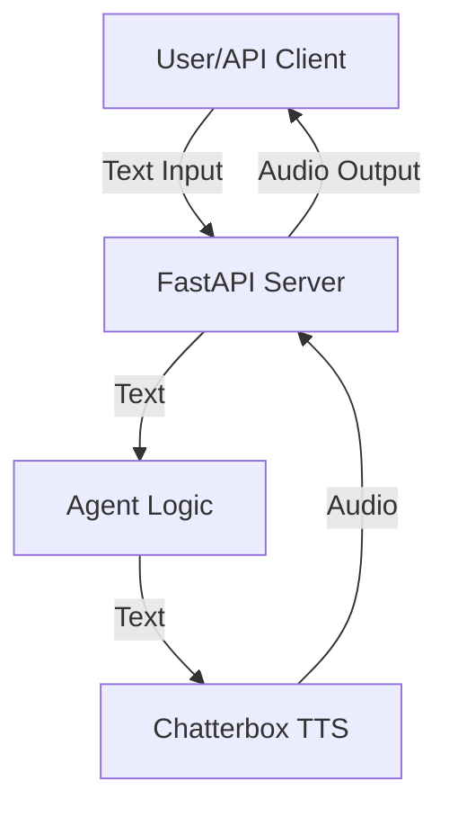

# Plan 1: End-to-End AI Voice Agent Framework with Chatterbox TTS

## Overview

This plan outlines the steps to build, document, and deploy a modular AI voice agent framework using Chatterbox TTS. The framework will be designed for extensibility, API integration, and potential deployment as an MCP (Multi-Channel Platform) server.

---

## 1. Project Setup

- Initialize Python project structure
- Set up virtual environment and dependencies (Chatterbox, FastAPI, etc.)
- Configure version control and .gitignore

## 2. Core Framework Design

- Define base interfaces for agents, TTS, and input/output modules
- Implement modular architecture for easy extension and swapping of components
- Add clear documentation and usage examples for each module

## 3. Chatterbox TTS Integration

- Integrate Chatterbox TTS as the default text-to-speech engine
- Provide configuration options for TTS parameters (exaggeration, cfg_weight, etc.)
- Add support for custom voice prompts

## 4. Agent Logic

- Implement a simple agent that takes text input and produces speech output
- Design agent to allow for future NLP/NLU integration
- Add hooks for pre/post-processing of text

## 5. API Layer

- Build a REST API using FastAPI to expose agent functionality
- Endpoints:
  - `/speak` (POST): Accepts text and returns audio
  - `/voices` (GET): Lists available voices/prompts
  - `/config` (GET/POST): Get/set TTS configuration
- Add OpenAPI documentation

## 6. MCP Server Considerations

- Design for multi-channel input/output (e.g., web, phone, chat)
- Implement channel abstraction layer
- Add support for asynchronous processing and scaling
- Plan for authentication and rate limiting

## 7. Testing & Validation

- Write unit and integration tests for all modules
- Add example scripts and API usage demos
- Validate TTS output quality and API performance

## 8. Deployment

- Containerize the application with Docker
- Provide deployment scripts for local, cloud, and MCP environments
- Set up CI/CD pipeline for automated testing and deployment

## 9. Monitoring & Maintenance

- Add logging and error handling throughout the stack
- Integrate basic monitoring (health checks, metrics)
- Document maintenance and update procedures

---

## Deliverables

- Modular Python codebase with clear documentation
- REST API for agent interaction
- Dockerfile and deployment scripts
- Example usage and test cases
- Project rules and best practices in .cursor/rules

---

## Next Steps

1. Confirm and refine this plan as needed
2. Begin with project setup and dependency installation
3. Proceed step-by-step, documenting and testing as we go

---

## Detailed Architecture, Educational Notes, and Visuals

### Chatterbox TTS: Capabilities & Limitations

Chatterbox is a state-of-the-art, open-source text-to-speech (TTS) model by Resemble AI. It supports:

- Zero-shot TTS (generate speech from text with a single audio prompt)
- Emotion exaggeration control (unique to Chatterbox)
- Fast, production-grade inference
- Watermarked outputs for responsible AI
- Easy voice conversion

**What it can do:**

- Turn any text into natural-sounding speech
- Mimic voices with a reference audio prompt
- Control expressiveness and pacing
- Integrate into agents, apps, or APIs

**What it cannot do:**

- It does not provide speech-to-text (STT)
- It does not include built-in dialog management or NLU
- It does not store or manage data (no built-in DB)

**Watermarking:**
Chatterbox embeds a neural watermark in every audio file it generates. This watermark is:

- Imperceptible to human listeners
- Survives common audio manipulations (e.g., MP3 compression)
- Used to verify the origin of generated audio, supporting responsible AI use

---

### Database/Storage

Currently, this plan and codebase do not reference any database or persistent storage. If you want to store user data, logs, or voice prompts, you can add a database (e.g., SQLite, PostgreSQL) later. For now, the framework is stateless.

---

### Project Tree (Python style, with JS comparison)

```plaintext
aivoiceagents/
│
├── agents/                # Python: package for agent logic (JS: like a folder of classes)
│   └── base_agent.py
│
├── tts/                   # Python: TTS integration (JS: like a service module)
│   └── chatterbox_tts.py
│
├── api/                   # Python: FastAPI app (JS: like an Express app)
│   └── main.py
│
├── tests/                 # Python: pytest tests (JS: like a __tests__ folder)
│
├── plans/                 # Project plans and docs
│
├── .cursor/rules/         # Cursor project rules
│
├── Dockerfile             # For containerization
├── requirements.txt       # Python dependencies (JS: package.json)
└── README.md
```

---

### High-Level Architecture (Mermaid Diagram)



- **User/API Client:** Sends text to the API (could be web, phone, etc.)
- **FastAPI Server:** Receives requests, routes to agent logic
- **Agent Logic:** (Optional) Pre/post-processes text, could add NLU/NLP
- **Chatterbox TTS:** Converts text to speech, returns audio (with watermark)
- **Audio Output:** Sent back to the user/client

---

### How the App Will Work (Step-by-Step)

1. **User sends text** to the `/speak` endpoint (e.g., via HTTP POST).
2. **FastAPI server** receives the request and passes the text to the agent logic.
3. **Agent logic** (could be simple or advanced) processes the text.
4. **Chatterbox TTS** generates speech audio from the text (optionally using a reference voice).
5. **Audio is returned** to the user as a response (e.g., WAV file).
6. **(Optional):** Add endpoints for listing voices, changing config, etc.

---

### Educational Python vs JS Notes

- **Python modules** are like JS files; packages are like folders with an `__init__.py`.
- **Classes and functions** in Python are similar to JS, but use indentation instead of `{}`.
- **FastAPI** is like Express for Python, but uses type hints and async by default.
- **Dependency injection** in Python is often done via constructor arguments, similar to passing dependencies in JS classes or functions.

---

### Example: Chatterbox TTS Usage in Python

```python
import torchaudio as ta
from chatterbox.tts import ChatterboxTTS

model = ChatterboxTTS.from_pretrained(device="cpu")  # Use 'cuda' for GPU

text = "Hello, this is your AI voice agent!"
wav = model.generate(text)
ta.save("output.wav", wav, model.sr)
```

_JS comparison: This is like importing a TTS library and calling a `generate()` function in Node.js._

---

### Next Steps

- Confirm this architecture and plan
- Decide if you want to add a database now or later
- Start with project scaffolding and dependency installation
