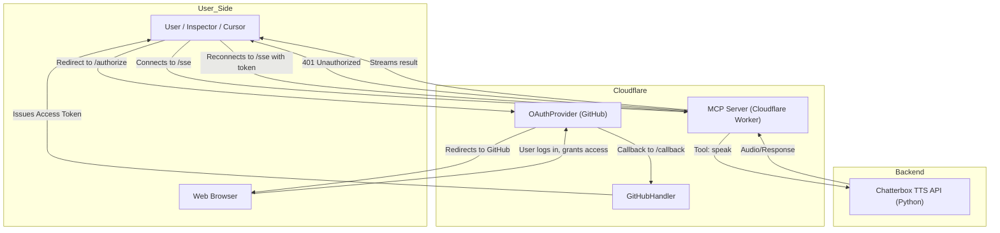

# MCP Server Architecture & User Flow

> For project overview and setup, see [../README.md](../README.md)

---

## Architecture Diagram (Mermaid)

---

## User Flow (Step-by-Step)

1. **User (or Cursor/Inspector) tries to connect to `/sse`**  
   → MCP server responds with `401 Unauthorized` and a `www-authenticate` header.
2. **User is redirected to `/authorize`**  
   → The Worker (via OAuthProvider) redirects the user to GitHub's login page.
3. **User logs in with GitHub and authorizes the app**  
   → GitHub redirects back to your Worker's `/callback` endpoint.
4. **Worker (GitHubHandler) processes the callback**  
   → Exchanges the code for an access token, issues a session/token for the user.
5. **User (or Cursor/Inspector) reconnects to `/sse` with the access token**  
   → Now authenticated, the MCP server lists available tools (e.g., `speak`).
6. **User invokes a tool (e.g., `speak`)**  
   → MCP server (Cloudflare Worker) calls your backend TTS API (Python).
7. **TTS API generates audio and returns it to the Worker**  
   → Worker streams the result back to the user via `/sse`.

---

## Summary Table

| Step | Actor                  | Action/Endpoint       | Result/Next Step      |
| ---- | ---------------------- | --------------------- | --------------------- |
| 1    | User/Inspector         | Connect `/sse`        | 401 Unauthorized      |
| 2    | User/Inspector         | Redirect `/authorize` | GitHub login          |
| 3    | User                   | GitHub login          | Redirect `/callback`  |
| 4    | Worker (GitHubHandler) | Process `/callback`   | Issue access token    |
| 5    | User/Inspector         | Reconnect `/sse`      | List tools            |
| 6    | User/Inspector         | Invoke tool           | Worker calls TTS API  |
| 7    | Worker/TTS API         | Generate/return audio | Stream result to user |

--- 

For more details, see the main [README.md](../README.md).
